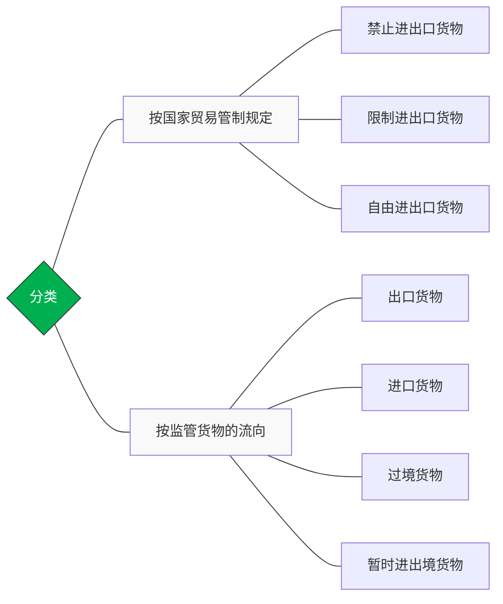
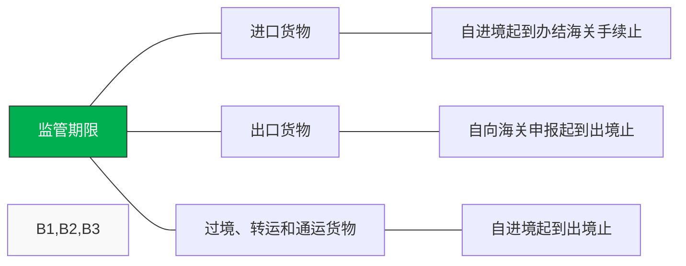
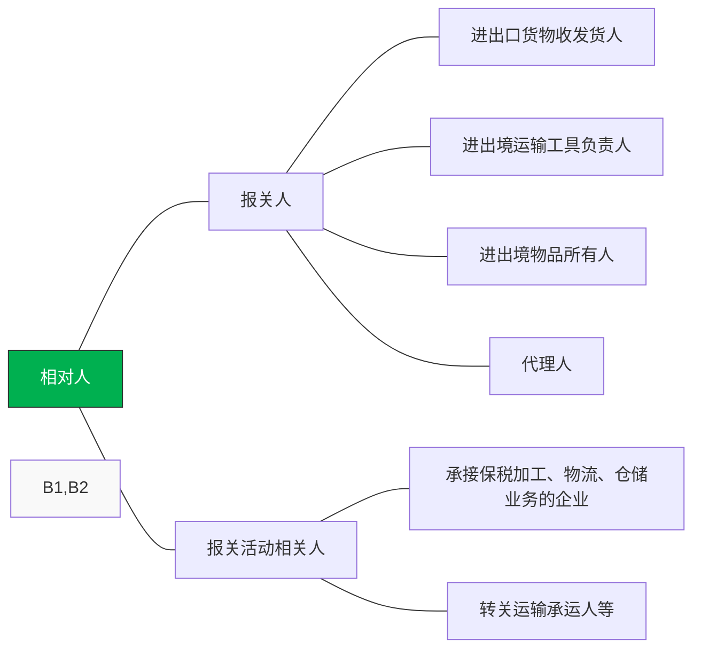
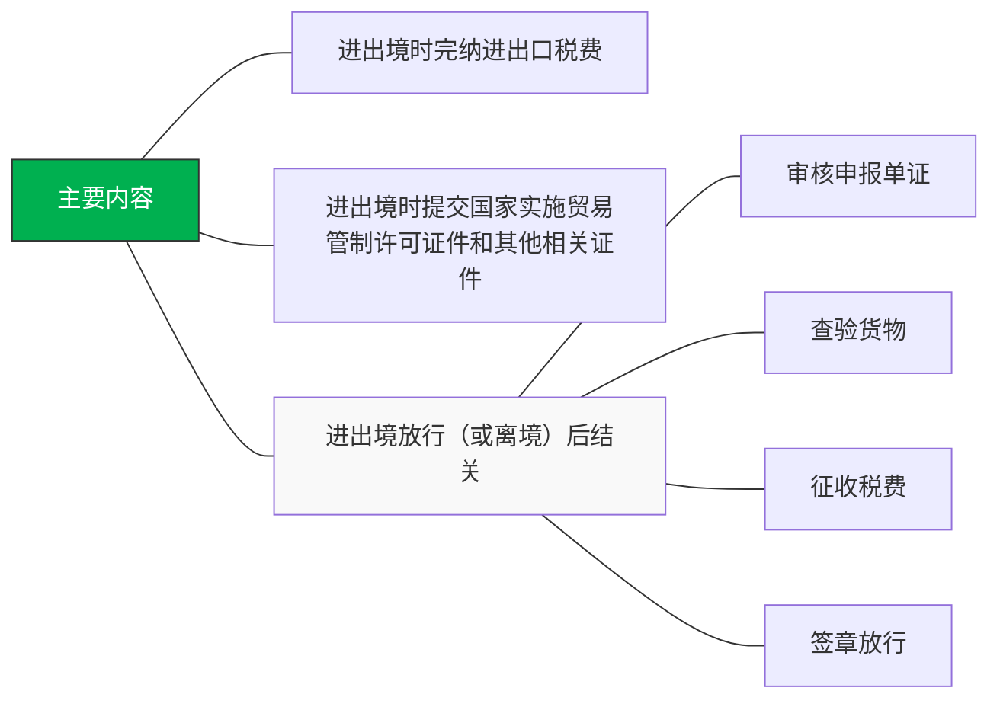
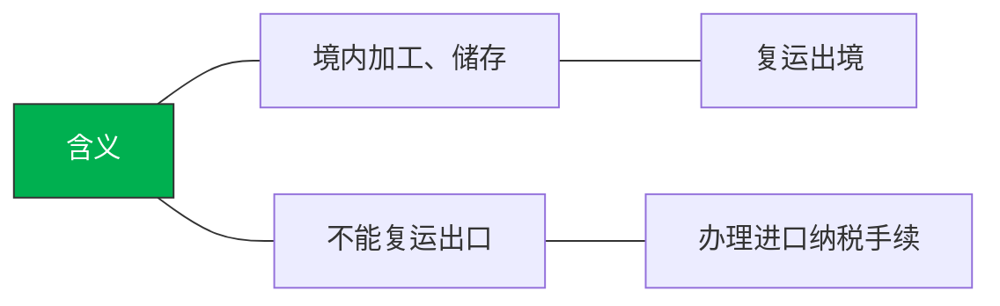

中华人民共和国海关总署（General Administration of Customs, GACC）是国务院直属的正部级机构

垂直管理，这意味着地方海关不受地方政府领导，而是直接听命于海关总署

AEO高级认证企业（Authorized Economic Operator）相当于外贸界的**“顶格绿卡”或“诚信金牌”**。

它是中国海关信用管理体系中的最高等级。获得这个认证，意味着该企业在内部控制、财务状况、守法规范及贸易安全这四大维度都通过了海关极其严苛的审核。

---

# 1 海关监管货物分类





# 2 海关监管期限



# 3 海关监察相对人



# 4 一般进出口监管制度



# 5 保税进出口监管制度


# 6 减免税监管制度
```mermaid
graph LR
    Root[分为三类]
    
    %% 第一分支
    Root --- B1[法定减免税]
    B1 --- C1[一般不进行后续管理]

    %% 第二分支
    Root --- B2[特定减免税]
    B2 --- D1[特定地区、特定用途、特定企业]
    B2 --- D2[海关规定的监管年限内，未经批准不得出售、转让或移作他用]

    %% 第三分支
    Root --- B3[临时减免税]
    B3 --- C3[根据特殊情况和需要，给予特别的临时性减免税优惠]

    %% 样式美化
    style Root fill:#00b050,color:#fff,stroke:#333
    style B2 fill:#f9f9f9
