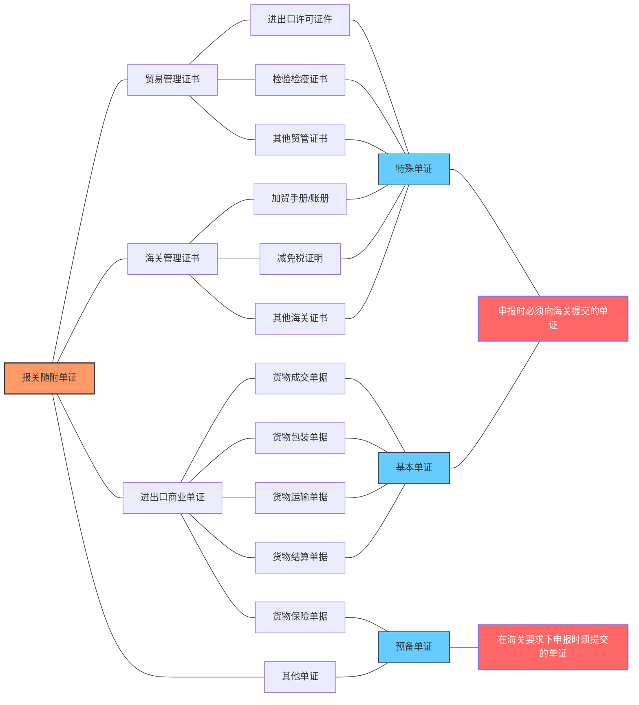

# 报关随附单证的种类及作用

```mermaid
graph LR
    Root[报关随附单证] --- A[贸易管理证书]
    Root --- B[海关管理证书]
    Root --- C[进出口商业单证]
    Root --- D[其他单证]

    A --- A1[进出口许可证件]
    A --- A2[检验检疫证书]
    A --- A3[其他贸管证书]

    B --- B1[加贸手册/账册]
    B --- B2[减免税证明]
    B --- B3[其他海关证书]

    C --- C1[货物成交单据]
    C --- C2[货物包装单据]
    C --- C3[货物运输单据]
    C --- C4[货物结算单据]
    C --- C5[货物保险单据]

    A1 & A2 & A3 & B1 & B2 & B3 --- Special[特殊单证]
    C1 & C2 & C3 & C4 --- Basic[基本单证]
    C5 & D --- Prepare[预备单证]

    Special & Basic --- Must[申报时必须向海关提交的单证]
    Prepare --- Request[在海关要求下申报时须提交的单证]

    %% 样式美化
    style Root fill:#f96,stroke:#333,stroke-width:2px
    style Must fill:#f66,color:#fff,stroke-width:2px
    style Request fill:#f66,color:#fff,stroke-width:2px
    style Special fill:#6cf,stroke:#333
    style Basic fill:#6cf,stroke:#333
    style Prepare fill:#6cf,stroke:#333
```

集装箱号：它是由四位的英文字母加七位的纯数字构成的，然后第四位永远是大写的一个 U 就是它的集装箱号码。
